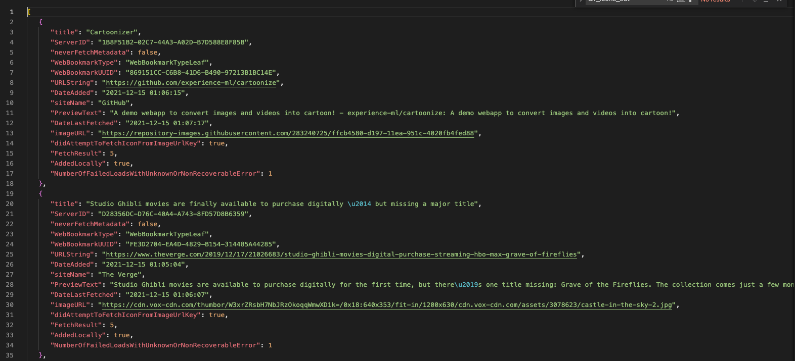
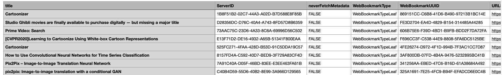
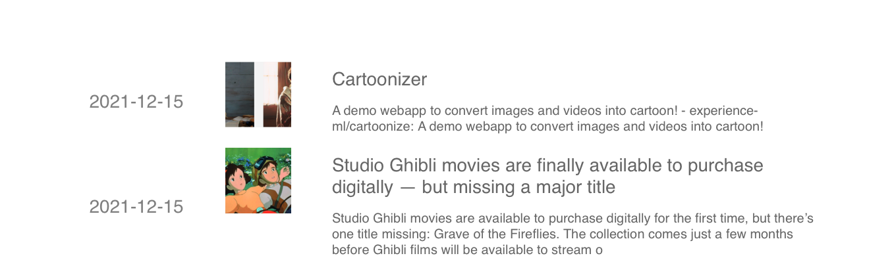

# Safari reading list in Python

`safarireadinglist` is a Python package to load your Safari reading list into Python, and to export it, including thumbnail icons.


## Sample results





## Installation

Install the `safarireadinglist` package in the root directory.

```bash
pip install -e .
```

Note: `setuptools` is the only requirement. For dev purposes, you may want to install the exact versions in `pip install -r requirements.txt`.

Final note: You need to give the terminal full disk access in the system preferences. See common errors below for instructions.

## Usage

In the command line, execute:

```bash
export-safari-rl export
```

The reading list will be in `reading_list.json`. You may also provide other options: `export-safari-rl --help`.

You can also export the icons from the reading list:

```bash
export-safari-rl export-icons
```

The icons will be in the `reading_list_icons` folder.

See also the [README](examples/README.md) in the [examples](examples) folder for more examples.

### Python package

The package is a Python package and can also be used as such. See [example_python.py](examples/example_python.py) for an example.

### Example of output format

See [reading_list.json](reading_list.json). The format is a list of dictionaries, where each dictionary conforms to the `safarireadinglist.ReadingListItem` dataclass.

### Website

To generate the website from the `website` folder, run:
```
cd website
python website.py reading_list.json reading_list_icons
```
The output is in the `website_out` folder.



## Known errors & solutions

If you are getting some error like this:
```bash
cp: /Users/XXX/Library/Safari/Bookmarks.plist: Operation not permitted
```
You need to give the terminal full disk access. Go to `Settings/Security & Privacy/Full Disk Access`. Navigate to `/Applications/Utilities/` folder and choose the `Terminal` app. If you are launching the command from VS Code you will need to add this as well.